# Project 1 for CS-351-02-1

## Validation of Deployment

Below are a set of screenshots that I took to validate my work after the website was deployed.

Testing the home page:
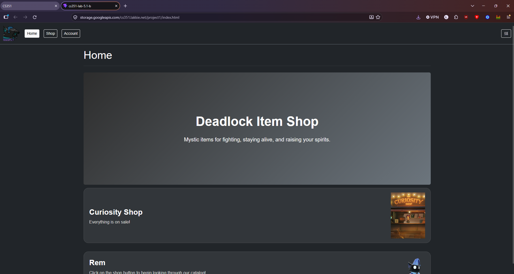
Testing the shop page:
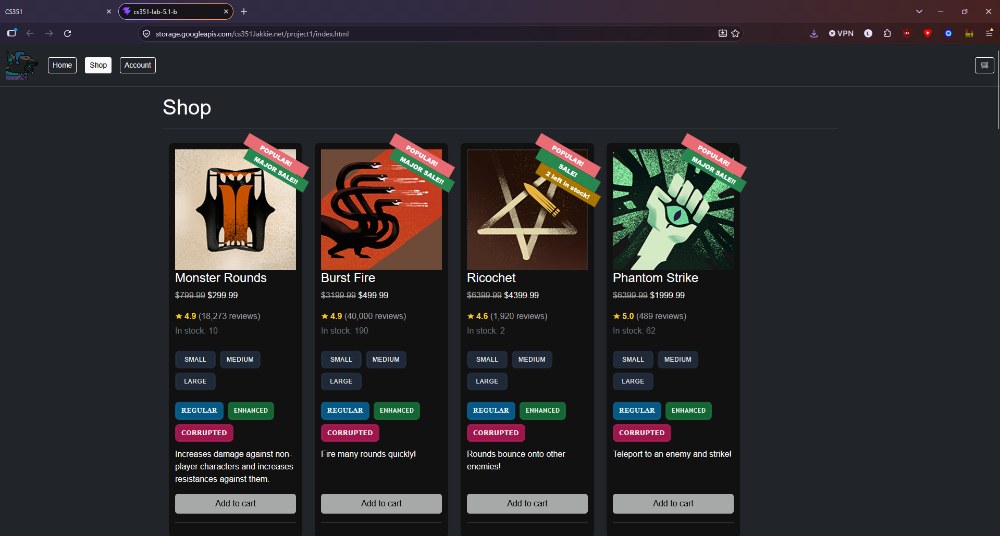
Testing that I can see the testimony, ratings, quantity in stock, etc in the product detail view:
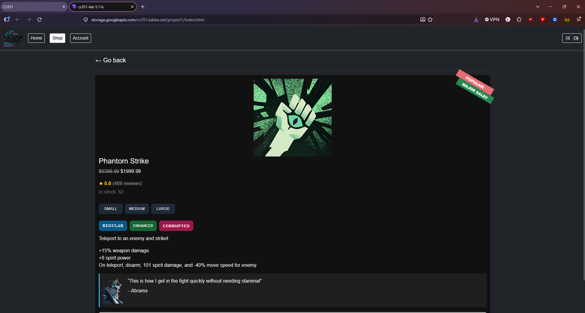
Testing the account page:
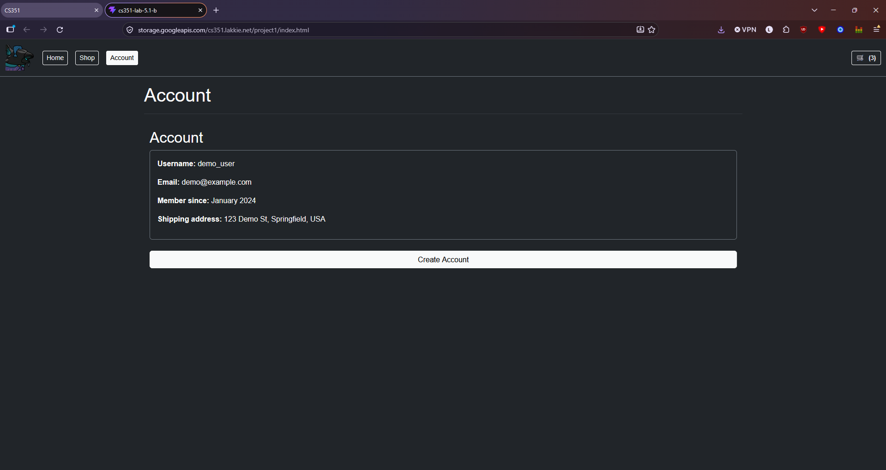
Testing the create account view page:
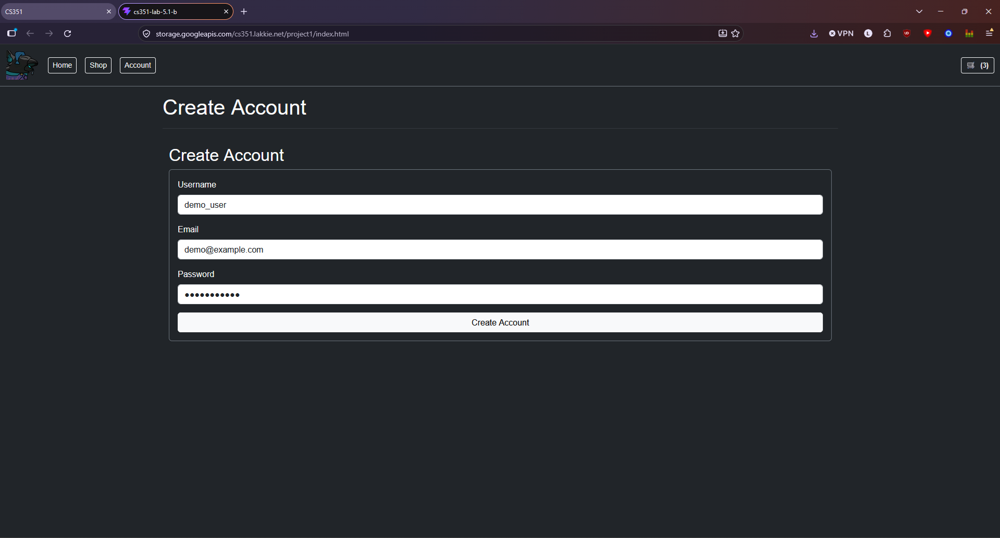
Testing the cart view:
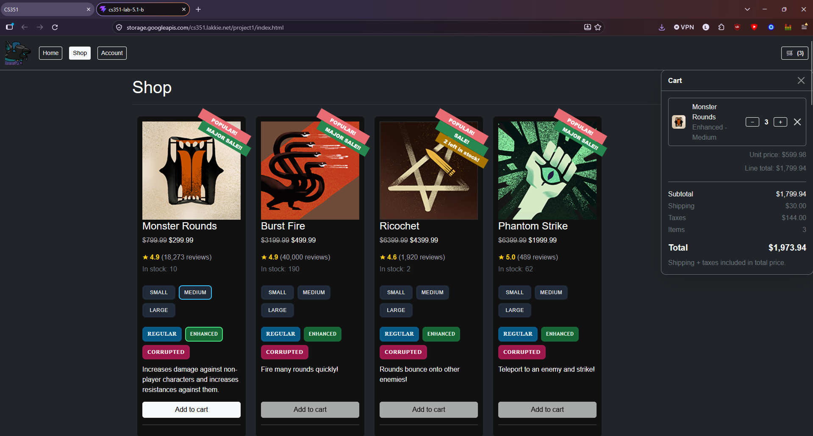

## Mobile Validation

Testing the home page:
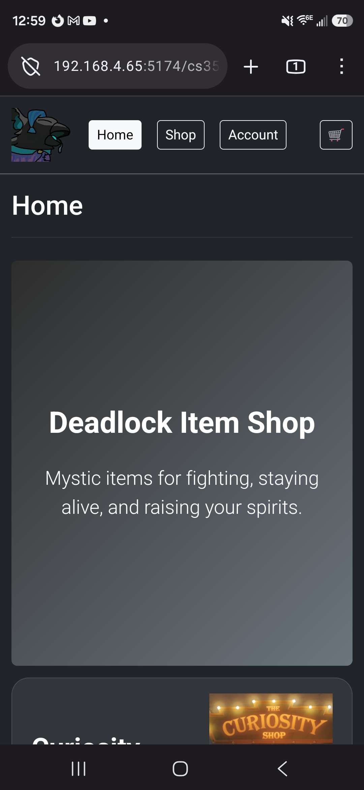
Testing that the home page scrolls:
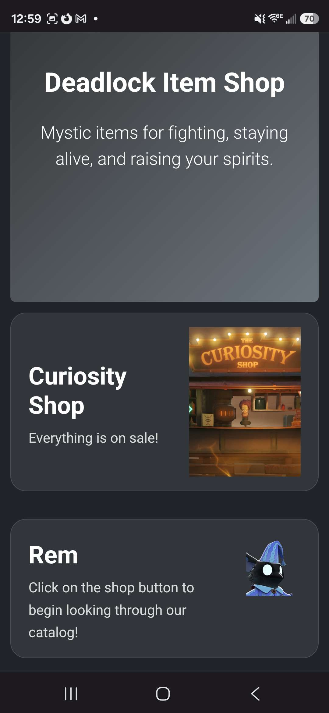
Testing the shop page:
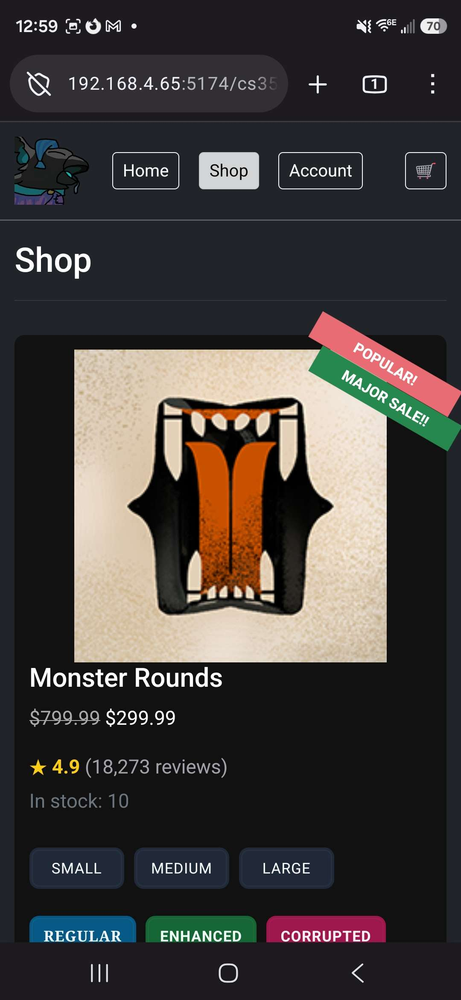
Testing that the shop page scrolls:
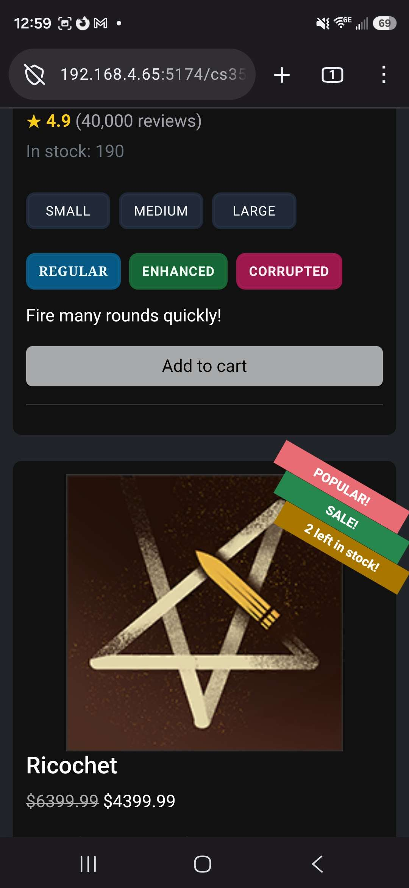
Testing that I can see the item I added to my cart:
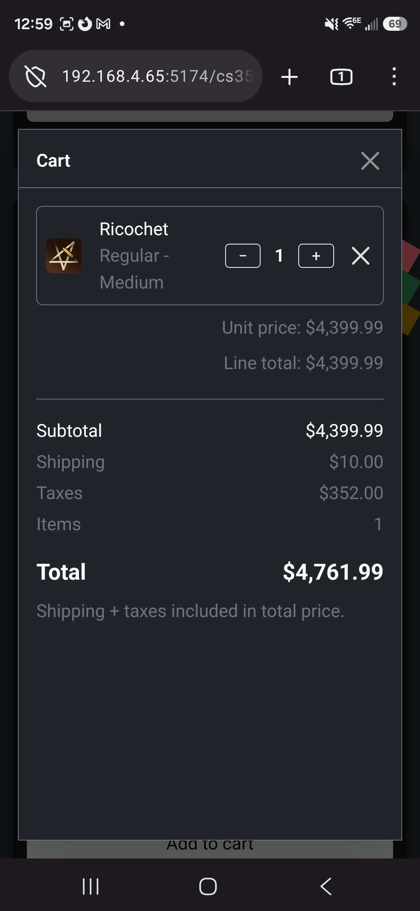
Testing that if I add lots of items to my I can still scroll without scrolling the background page:
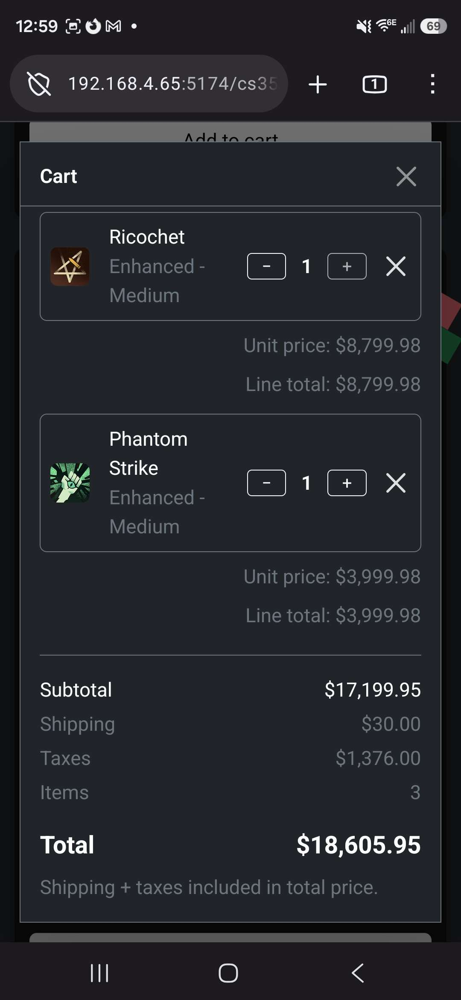
One more test:
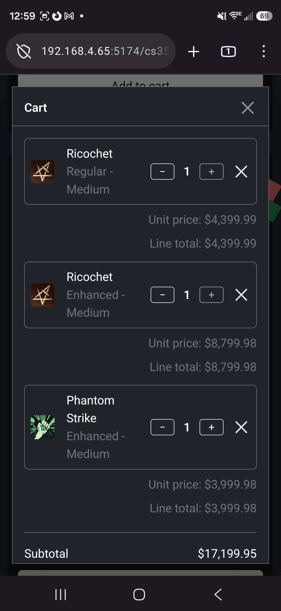
Testing the account page:
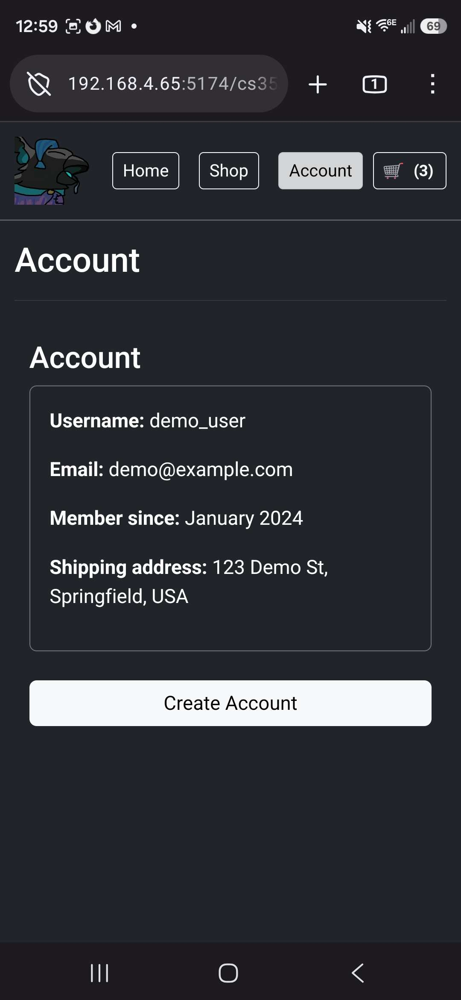
Testing the create account page:
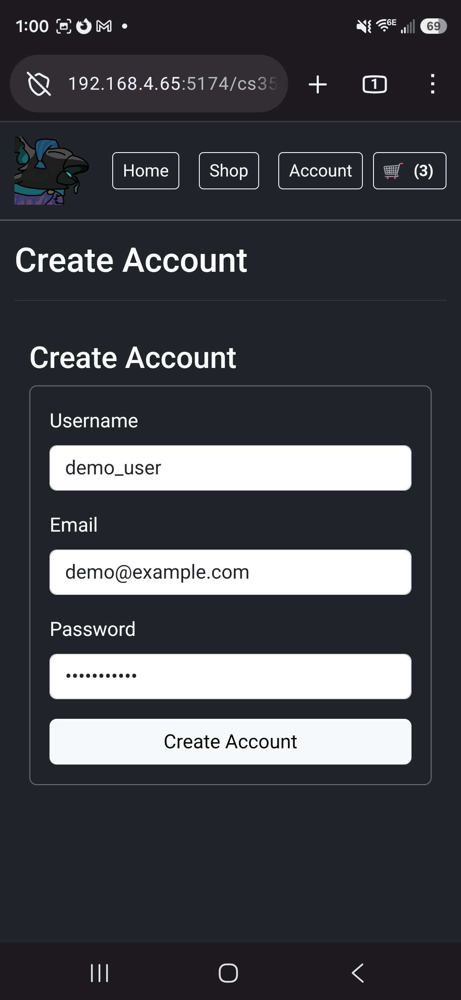

## Technologies used

I used Bootstrap 5 for much of the page layout to stylize the home page, store catalog, etc. I went with a flex layout for the main store layout because I felt that it would give the most natural flow and was the latest CSS technology that I could use. I tried to keep as much styling within Bootstrap rather than writing my CSS class definitions, although it did require a lot of styling to keep it formatted correctly and how I wanted it to be.

I did use Copilot to help me write much of the boilerplate code on top of copying much of what we did from the earlier lab projects. This website looks very similar to the React Tic-Tac-Toe demo project because this project was actually initialized as a copy of that Tic-Tac-Toe project. I then cleared out the App and started by creating ProductList and ProductCard components, which I sorted under the "components" directory because they could theoretically be utilized in other places other than just the shop page.

I then added the cart functionality and created a home page. I then had a boilerplate of my website using Bootstrap 5, React/JSX + Vite, and no other dependencies. I wanted to use the React Router because I thought that it would help in testing. If I got the server to use separate URLs like /shop/ and /home/ and /account/ for each page, it would mean that I would automatically get redirected to each page when I reload and that I could send links to other people for specific items. However, I looked over the project description and decided that the simplest model was the React single-page application which would not do any routing, since our deployment would be to a static website, and I wanted to keep all of the different page logic in React/JSX rather than the raw HTML5 index.html file.

I wrote almost all of the home view myself using the shop page as a model and using the Bootstrap 5 documentation, although I did try initially using Copilot. I did not like the results that Copilot gave and it seemed to be quite confused by the way I wanted to lay things out, so I decided to organize it myself. I also wrote much of the main shop layout by myself, but I did leave Copilot the detailed product view because I added many features to that view while developing the `products.json` file that I wanted to focus on editing the JSON file to have as many capabilities as possible(big sale, on sale, limited quantity, popular, etc.). I felt that those attributes helped the site come to life and make it seem like there were real users using the website. I also added testimonies for some of the items, which I've seen on many online retailers' websites, and I felt that it would add some character to each of the items. I also wrote the total and subtotal logic by myself because I wanted to tweak it and ensre that I understood how the total calculation worked, and that it was realistic to what you could actually see in an online store.

One of the major bugs that I relied on Copilot for was because of my decision related to switching to the React Router for page navigation back to no browser navigation and having it be a React SPA. Because StrictMode was still enabled, it seems like that when I would increment the number of products in the cart view it would increase by 2. Copilot found that problem and I removed strict mode and added a `normalizeCart` function which would ensure that we are applying the quantity to one item and that it is applied to the correct item.